## 0x00
便携式机箱有很多，如果你想亲自动手组上这么一台，你可能要花点功夫研究以下几点细节。

- 机箱尺寸
- 是否要上显卡
- 电源使用哪一种，sfx还是小1u电源，或者是标准atx电源，或者是dc-atx电源
- 主板的尺寸是否符合机箱规定的主板尺寸，大部分小机箱只能放itx或者小尺寸的m-atx。
- 处理器散热器规定的限高是多少，装进去会不会超高
- 内存条会不会被散热器遮挡，马加内存条的高度会不会超高
- 如果机箱能上显卡，显卡的长度是否有限制，是否需要单槽或者是半高显卡，基本上能装显卡的小机箱还需要一根显卡延长线来转接显卡。
- 最重要的一点：预算预算预算，itx设备一般比标准的设备要贵，当然你可以选择捡垃圾维持生存啊！

现在，我花点时间给大伙搜集一些资料，包括具体的尺寸和参数，方便大家挑选。当然，这东西最终还是要靠自己完成才有成就感。我给的配置不是死的，只要符合机箱的要求的配置都可以安装。另外不建议新手装，装小机箱还是需要更多的时间和精力的。

正文开始！！

## 0x01

### 了解 itx和thin-itx

何为Thin-ITX主板？顾名思义，Thin ITX主板就是更纤薄的ITX主板。与标准ITX主板相比，它的I/O接口更矮，你可以理解为只有一层，itx主板可以理解为两层。对比图如下：

thin-itx 主板

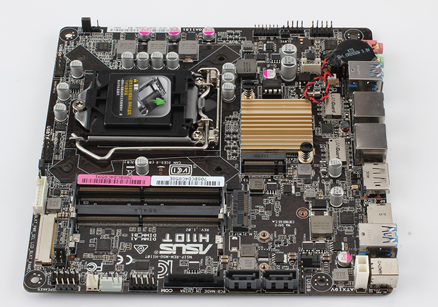

thin-itx 的I/O接口

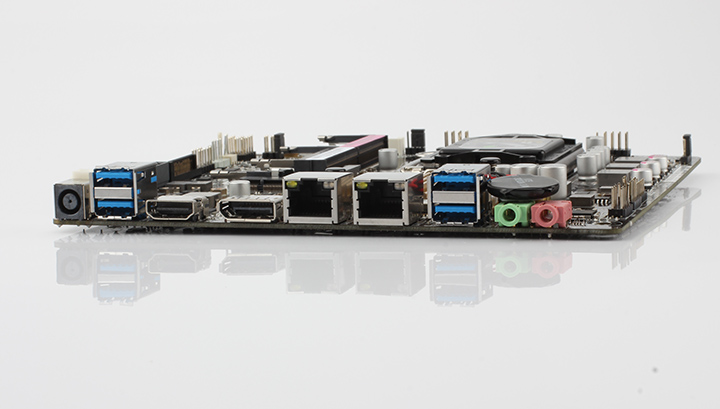

itx 主板

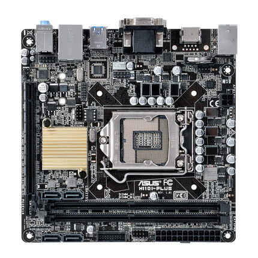

itx 的I/O接口

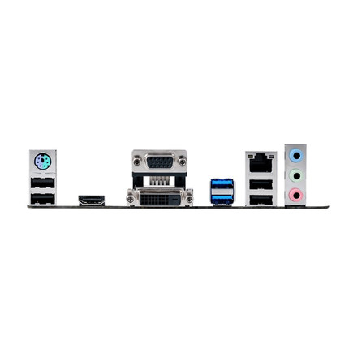

观察一下，明显要矮很多。而且thin-itx主板一般自带一个DC电源接口，图片thin-itx I/O接口，最左边的那个。卖家会和你说清楚支持15v还是12v。

### thin-itx 机箱推荐

**1. 立人 E-T3**

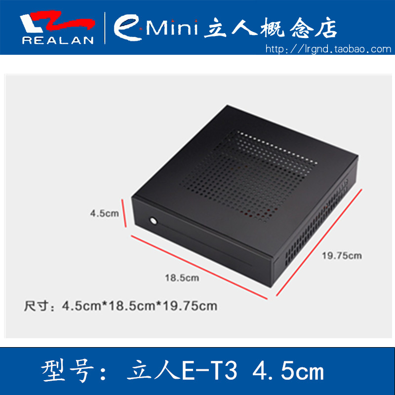

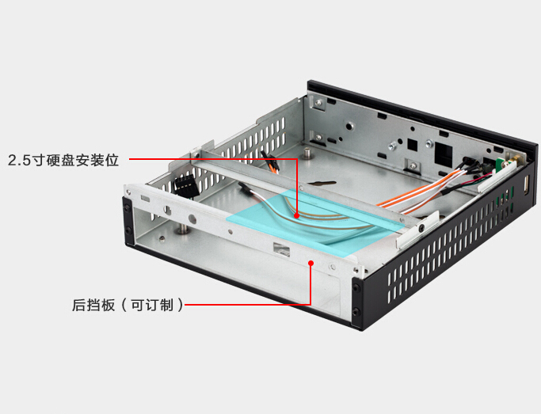

这款thin-itx机箱价格比较便宜，空机箱只要80元就能买到，如果只是用来办公的话，可以在淘宝上买老平台，总的下来估计只要1000块不到。

**2. 跃星 GH1**

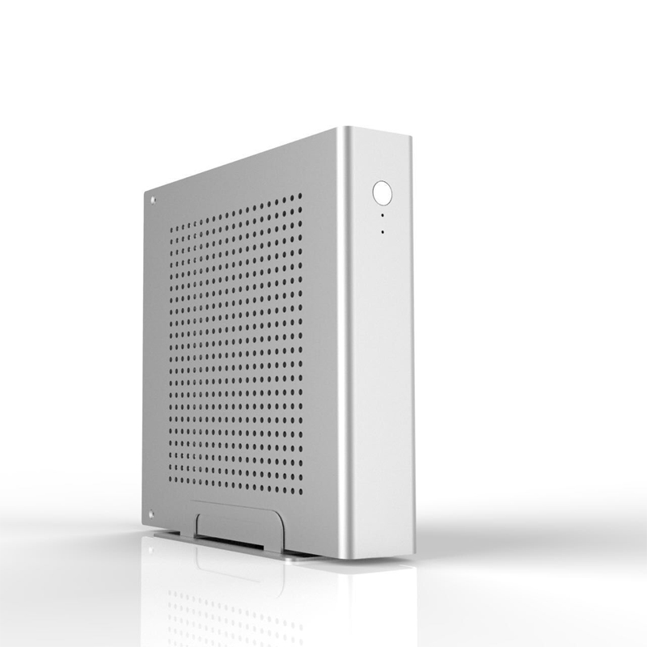

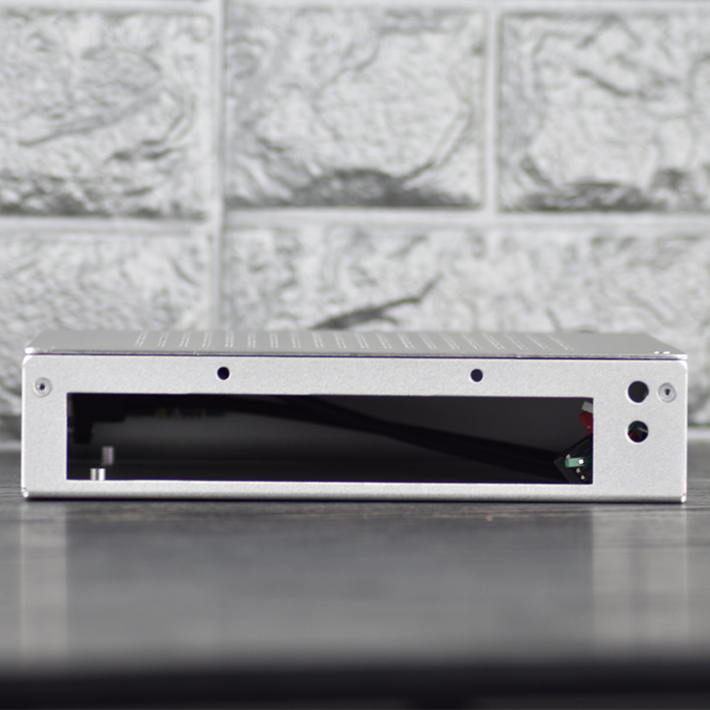

尺寸是 $200mm * 200mm * 45mm$

这款thin-itx机箱价格也相对便宜，空机箱125元就能买到，比立人多一个支架。散热器限高为27mm。

**3. 银欣 SST PT13B**

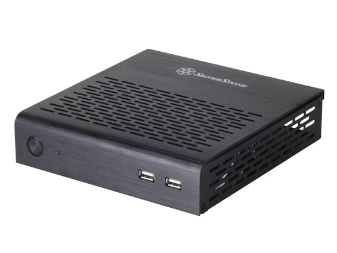

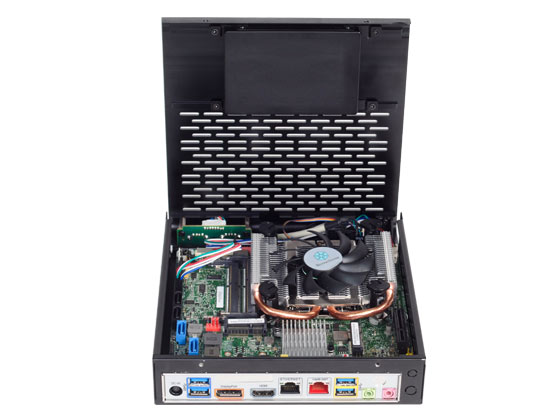

这款银欣和上面两款比起来，价格要高了许多，当然颜值和做工要高上不少。价格基本在300左右，追求颜值的朋友可以入一个。

尺寸是 $186mm * 181mm * 42mm$，散热器限高30mm。

**4. akasa fanless thin itx**

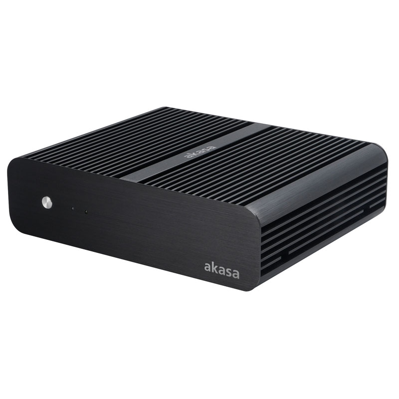

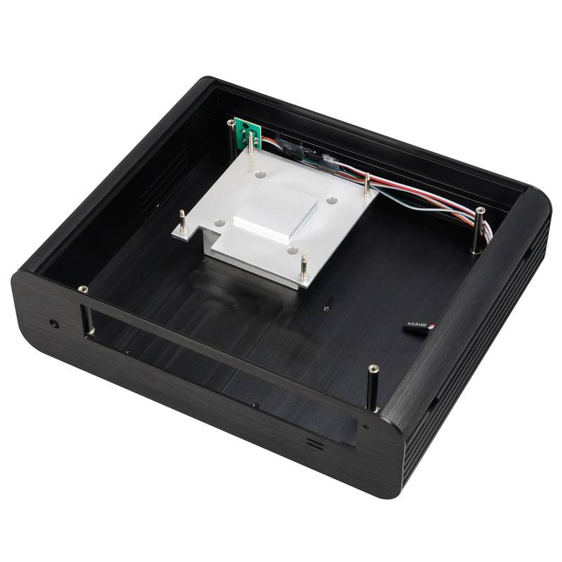

来自英国的高端品牌，价格也非常高端的，大概600多块钱吧！属于fanless系列，所谓fanless就是无风扇设计，使用机箱作为散热导体，适用于发热量较低的平台。最好上个带T的处理器，比如i3-8100t之类tdp较低的U，应该能压得住。有兴趣的朋友可以上网研究一下。

